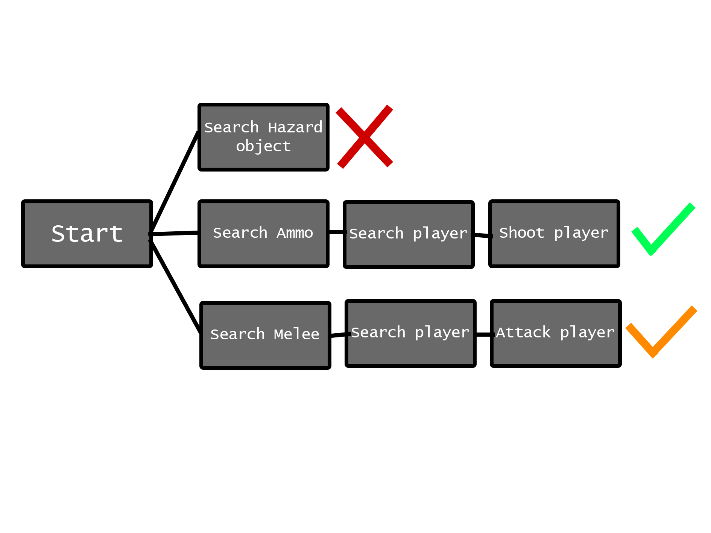
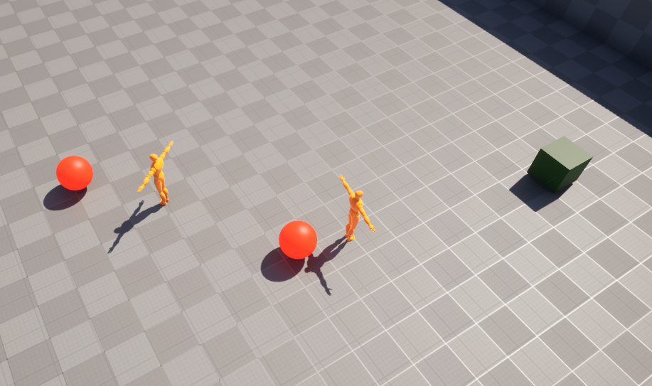
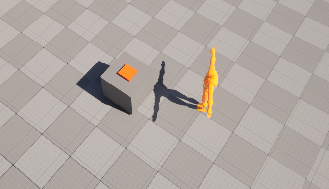
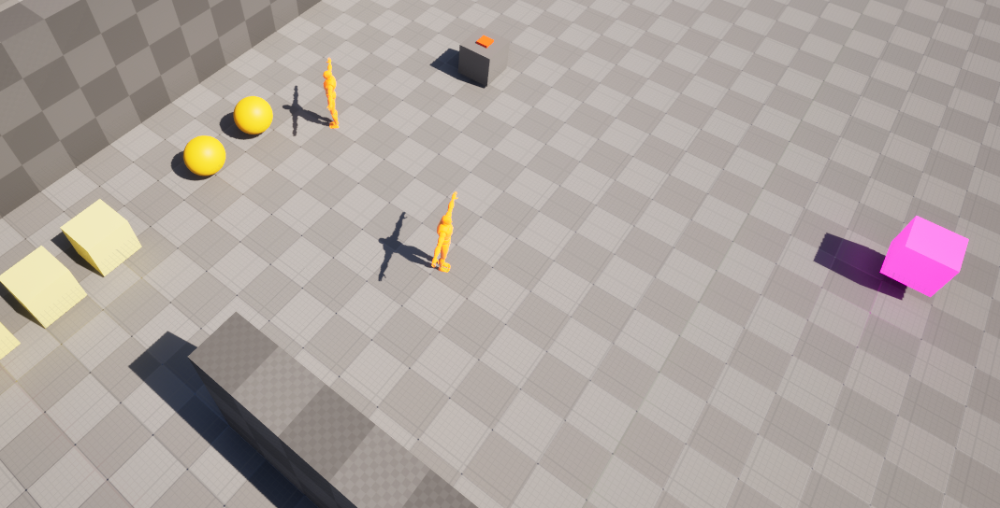
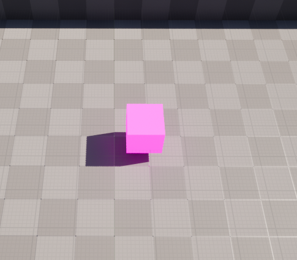

# 🧠 GOAP Enemy AI

> A implementation of a GOAP system in Unreal Engine

---

# 📖 What is GOAP?

**GOAP (Goal-Oriented Action Planning)** is a Stanford Research Institute Problem Solver that allows npc's to behave in a believable dynamic way. 
Instead of following pre-scripted behaviours the agents make decisions based on goals they want to achieve during the game. Breaking down a complex task into a sequence of multiple actions.
This sequence is contingent on both the state of the world and the state of the agent. Meaning that the actions of one agent might differ from the other.

---

# 🎮 Purpose of the Project

The project demonstrates how GOAP can create believable AI without relying heavily on scripted behaviors. 
Instead of using a large finite state machine or behavior tree, the program dynamically plans sequences of actions to achieve goals within the game world.
The system is modular and highly customizable, making it an effective solution for creating intelligent NPCs in games.

Each AI agent has the following behaviour:
- Clear hazards within the scene
- Sound the alarm when the player is spotted
- Kill the player when alerted

---

# ⚙️ Core System
A solid GOAP system consists of the following components:

## 🌍 (World) State

The AI-Controller holds the state of the agent and the world.
In this implementation the state is a map of names and booleans.
Based on these states the GOAP system generates a plan of **actions** to achieve a specific **goal**

Individual states are updated by the actions and the controller, while world states are updated by the gamemode.
Aside from this separation in responsibility, there is no major distinction between a world state and an individual state.

### Examples (Individual states)
- HasAmmo
- SeesPlayer

### Examples (World states)
- AlarmOn
- HazardsInScene

---

## 🧩 Goals

A goal represents the objective the agent wants to achieve, or more specifically, the state the agent aims to reach.
The planner creates a sequence of actions intended to transform the agent’s current state into the desired goal state.

### Examples
- PlayerAlive *false*
- AreaSafe *false*
- HasAmmo *true*

Goals can be changed manually by the developer or dynamically in response to events that occur within the game, such as:
- An alarm being triggered
- The player dying

---

## 🔨 Actions

An action is a task performed by the agent.
Each action contains:
- Preconditions
- Effects
- Failed Effects
- Cost

Besides a start and tick function each action contains behaviour specific to that action.

The preconditions define the state the agent must be in before the action can be executed.
The effects are the changes of the agent's state when the action finishes.
The cost is used by the planner to prioritize certain actions over others.

In this implementation, actions can either succeed or fail, both have effects on the state of the agent.

---

## 🗒️ Planner

The planner is the core system that drives the entire process.
It calculates a sequence of actions by using an A* algorithm to determine the cheapest and most efficient plan for achieving the desired goal.

The GOAP planner is an A* planner where each node contains a state, GCost, HCost, a plan, and a list of remaining actions. Since each action can only be performed once, actions are removed from the remaining action list after being used.

The planner iterates over the open set, which initially contains only the start node. The open set is sorted based on the total cost, and each node is checked to determine whether the goal has already been reached or whether the GCost exceeds the allowed limit.

Afterwards, the planner iterates over the remaining actions and creates child nodes for the actions whose preconditions are satisfied. These child nodes are then added to the open set.

---

## 🧠 Controller

The agent’s AI Controller also contains additional logic.
It recalculates the plan whenever a meaningful world state changes or when an action fails.

The controller also maintains the list of available actions and, in this implementation, includes an idle-action failsafe in case no valid plan can be found or the current goal has already been achieved.

---

# 🔫 Implementation

The idea behind the current implementation is that agents aim to make the environment safe by clearing hazards and eliminating players on sight.

## ☣️ Hazard Clearing

The agents begin by clearing hazards in the scene, picking them up and transporting them to the garbage disposal area.

---

## 👁️ Detection

Each agent has a pawn sensing component. If this component detects a player, the agent becomes alerted and is assigned a new goal: "to sound the alarm".

---

## 🚨 Alarm

When the alarm is triggered, all agents become alerted and are assigned the goal of eliminating the player.

---

## 🏃 Pursuit

The agents first attempt to acquire ammunition or a melee weapon, prioritizing ammo.
Once equipped, they move into range of the player and attempt to attack. 
If an attack misses, they lose their current weapon or ammo and will seek out a replacement before trying again.

---

## 💀 Player 

The player is a purple cube controlled with the WASD keys.
If the player dies, the agents return to their primary task of clearing hazards in the scene.

---

# 🛠️ Technical Features

- Unreal Engine 5
- Unreal C++
- GOAP A* Planner
- Pawn Sensing
- Navigation Mesh

---

# 📖 Sources

[Goal Oriented Action Planning - Vedant Chaudhari](https://medium.com/@vedantchaudhari/goal-oriented-action-planning-34035ed40d0b)

[GOAP - CrashKonijn](https://goap.crashkonijn.com/)

[AI in F.E.A.R - AI and Games](https://www.youtube.com/watch?v=PaOLBOuyswI)

---

